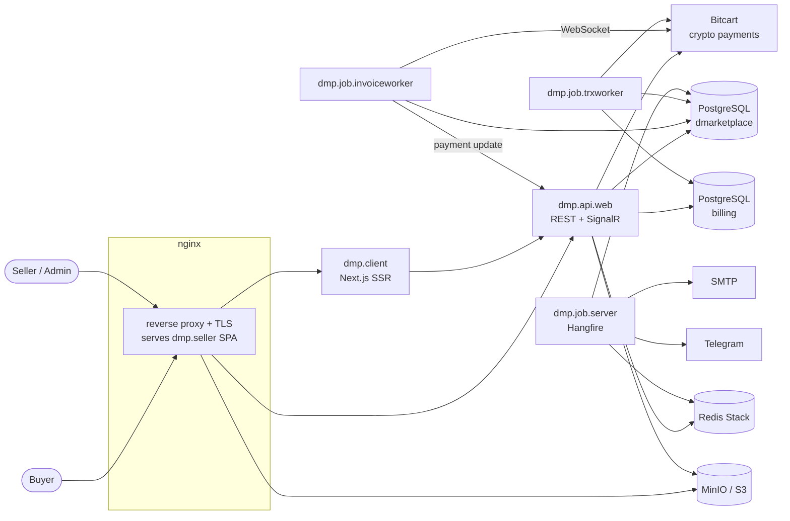

# DMP — Digital Marketplace

DMP is a marketplace for digital goods and data. Sellers publish downloadable products, buyers pay for them in
cryptocurrency, and the platform handles invoicing, settlement, seller balances and payouts.

The system is split into independent repositories — two web frontends, an ASP.NET Core API, three background
workers and a Docker Compose infrastructure repo. This repository is the entry point: it describes the architecture
and links to every part.

## Repositories

| Repository | Description | Stack |
|---|---|---|
| [dmp.client](https://github.com/denis-susha/dmp.client) | Buyer storefront: catalog and search, cart, checkout with crypto invoices and live payment status, downloads, account. | Next.js 16, React 19, TypeScript, Tailwind CSS 4, styled-components, zustand, SignalR |
| [dmp.seller](https://github.com/denis-susha/dmp.seller) | Seller dashboard SPA: product management, sales statistics, finances and withdrawals, support tickets, admin moderation. | React 19, TypeScript, MUI 9 + MUI X, MobX State Tree, React Router 8, webpack 5 |
| [dmp.api.web](https://github.com/denis-susha/dmp.api.web) | Main REST API for both frontends: auth, catalog and full-text search, products, cart, orders, Bitcart invoices, finances, support; SignalR hub for payment updates. | ASP.NET Core 10, EF Core 10 + PostgreSQL, Redis Stack, MinIO |
| [dmp.job.invoiceworker](https://github.com/denis-susha/dmp.job.invoiceworker) | Tracks Bitcart invoices over WebSocket, applies payment status to orders and notifies the API. | .NET 10 worker, EF Core, Bitcart WebSocket API |
| [dmp.job.trxworker](https://github.com/denis-susha/dmp.job.trxworker) | Turns confirmed payments, payouts, transfers and bonuses into ledger transactions and account balances in the billing database. | .NET 10 worker, EF Core, PostgreSQL |
| [dmp.job.server](https://github.com/denis-susha/dmp.job.server) | Hangfire job server: e-mail delivery, product search cache in Redis, Telegram system notifications. | ASP.NET Core 10, Hangfire, RazorLight, Redis Stack |
| [dmp.api.notifications](https://github.com/denis-susha/dmp.api.notifications) | Optional Bitcart webhook relay that forwards invoice status callbacks to a payment gateway URL. Not enabled in the default deployment. | ASP.NET Core 10 |
| [dmp.docker](https://github.com/denis-susha/dmp.docker) | Docker Compose infrastructure: all services, PostgreSQL, Redis Stack, MinIO, nginx with TLS, and the Bitcart payment stack. | Docker Compose, nginx, Bitcart |

## Architecture



### Payment flow

1. The buyer checks out in **dmp.client**; **dmp.api.web** creates an order and a Bitcart invoice.
2. **dmp.job.invoiceworker** picks up the pending invoice, subscribes to its Bitcart WebSocket, records payments
   and updates the order status.
3. On every status change it calls **dmp.api.web**, which pushes the update to the buyer over SignalR
   (`/paymenthub`).
4. When the invoice is final, the invoice worker queues a task for **dmp.job.trxworker**, which writes the income
   transaction, the platform fee and the seller's share to the billing ledger.
5. **dmp.job.server** sends the purchase e-mail and refreshes the product search cache.

Seller payouts, incoming transfers and bonuses created by admins in **dmp.seller** go through the same
**dmp.job.trxworker** task queue.

## Data stores

| Store | Used by | Purpose |
|---|---|---|
| PostgreSQL `dmarketplace` | api.web, invoiceworker, trxworker, job.server | Users, catalog, products, orders, payments, worker task queues, mail queue, Hangfire storage |
| PostgreSQL `billing` | api.web, trxworker | Accounts, transactions, ledger records, balances |
| Redis Stack (RedisJSON + RediSearch) | api.web, job.server | Product search index, catalog cache, refresh tokens, system notification queue |
| MinIO (S3) | api.web, frontends | Product files, images, static content |

## Getting started

Clone all repositories side by side — the Compose files in `dmp.docker` build the services from sibling folders:

```bash
mkdir dmp && cd dmp
git clone https://github.com/denis-susha/dmp.docker.git
./dmp.docker/prepare-build.sh    # clones the remaining repositories next to dmp.docker
```

or use the script in this repository:

```bash
./clone-all.sh [target-dir]
```

Then follow the [dmp.docker README](https://github.com/denis-susha/dmp.docker#readme) to create the env files and
bring the stack up. Each repository's README describes how to run that service on its own for development.

### Requirements

- Docker with Compose v2.24+
- .NET SDK 10 for the backend services
- Node.js 24 for the frontends

## Configuration

No repository contains credentials. Every service ships an `.env.example` (and `appsettings.json` with empty
values for .NET services) that lists the settings it needs; copy it and fill in real values, or supply them as
environment variables through `dmp.docker`.
